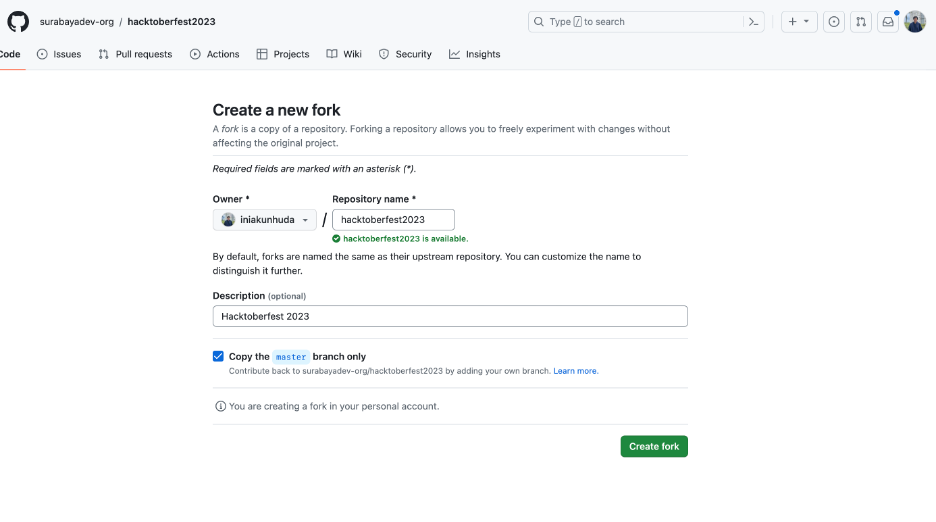
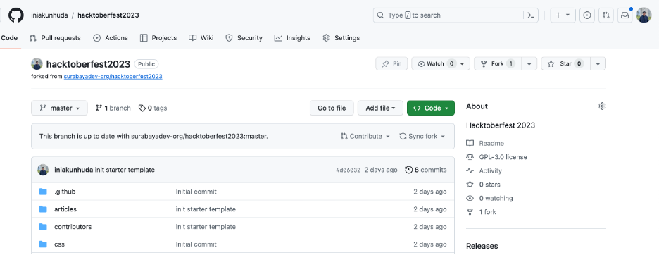
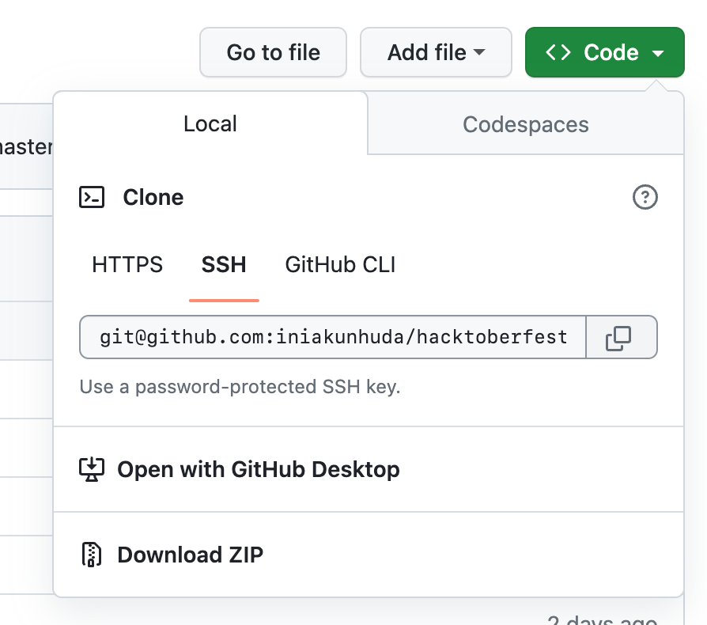
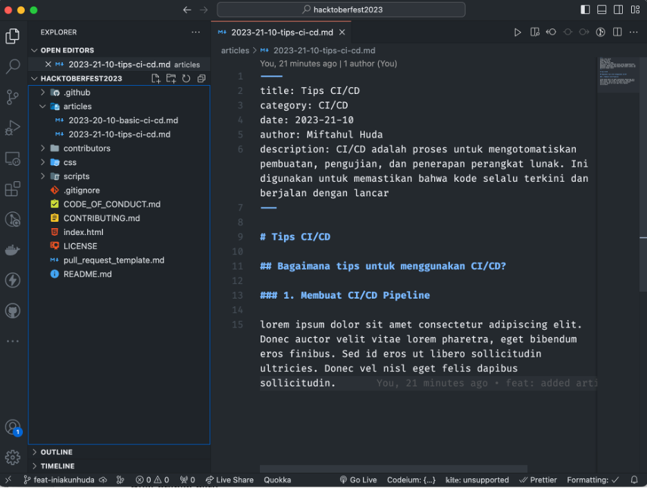
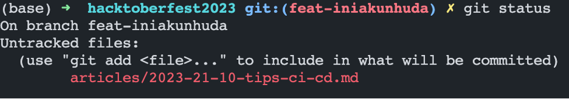
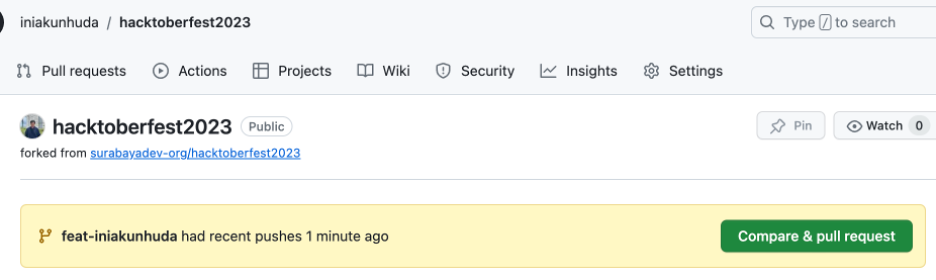
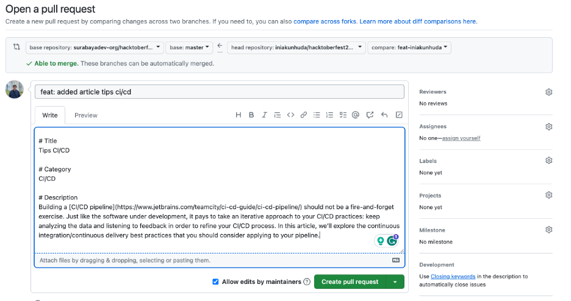
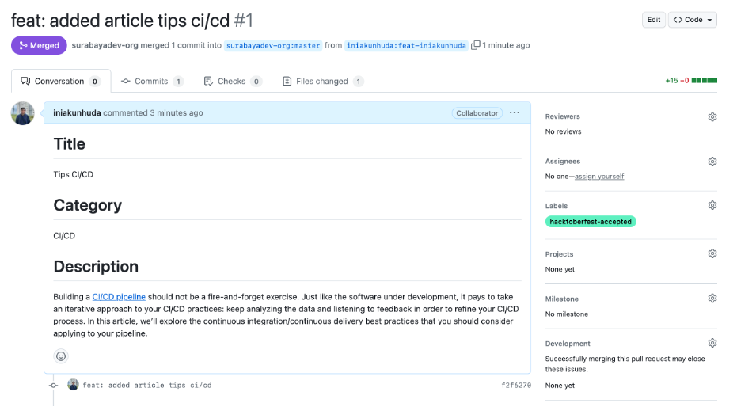
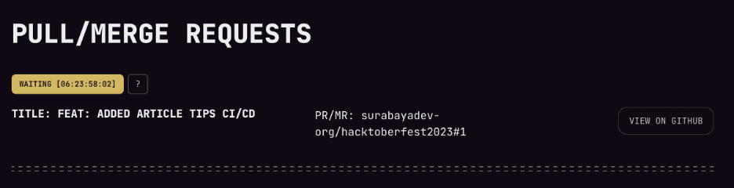

Hacktoberfest-2023

# Rule kontribusi

- Kamu bisa menambahkan artikel di folder **articles/** dengan memilih salah satu topik antara **CI/CD** atau **Basic Pentest**
- Artikel yang kamu tulis akan kami publish ke media sosial (medium) dan akan menyertakan profil kamu sebagai kontributor
- Ikuti step di bawah ini agar kontribusi kamu bisa dihitung sebagai kontributor di Hacktoberfest


# Step untuk kontribusi 🤩🤗:

- Klik tombol **Fork** di atas. Sehingga akan muncul halaman berikut. Klik tombol **Create fork**



- Setelah berhasil fork, klik tombol **Code** dan pilih Clone dengan https / ssh





- Kamu juga bisa menjalankan step ini di terminal menggunakan command berikut

```terminal
git clone https://github.com/{username}/hacktoberfest2023.git
```

- Di terminal, pindah direktori ke folder **hacktoberfest2023**
  
```terminal
cd hacktoberfest2023
```

- Buat branch baru dengan nama **feat-{username github kamu}**
Misalnya:

```markdown
git checkout -b feat-iniakunhuda
```


- Buka project di text editor kesayangan. Tambahkan artikel baru dengan membuat membuat file baru di folder **articles**. Sesuaikan nama file {tahun}-{tanggal}-{bulan}-{judul-artikel}.md

```
----
title: Judul artikel
category: Kategori
date: {tahun}-{bulan}-{tanggal}
author: nama kamu
description: xxx
---
Isi artikel xxx
```



- Cek perubahan di terminal

```terminal
git status
```



- Setelah selesai membuat file, tambahkan file tersebut ke repo git dengan command berikut di terminal

```terminal
git add .
```

- Commit perubahan dengan kode berikut
  
```terminal
git commit -m "feat: added article xxx"
```

- Kemudian push ke branch yang telah dibuat

```terminal
git push origin feat-{username github kamu}
```

# Pull Request

- Buka lagi github repository kamu, akan ada notif berwarna kuning. Klik tombol **Compare & pull request**



- Jelaskan perubahan pull request kamu sesuai dengan format berikut ini. Setelah itu, klik tombol **Create pull request**




- Selamat! 🎉 Kamu telah ikut berkontribusi di Hacktoberfest! Surabayadev akan mereview pull-reques kamu jika sudah sesuai dengan rule di atas.


# Note

Surabayadev akan mengaccept artikel dengan isi yang benar dan akan diaccept dalam minggu ini (sebelum hacktoberfest selesai). Setelah itu, tunggu saja dan otomatis status di hacktoberfest akan berubah dengan sendirinya.

Pull request yang sudah diaccept oleh SurabayaDev


Status di hacktoberfest



## Our Top Contributors 
<p align="center"><a href="https://github.com/surabayadev-org/hacktoberfest2023/graphs/contributors">
  
</a></p>
